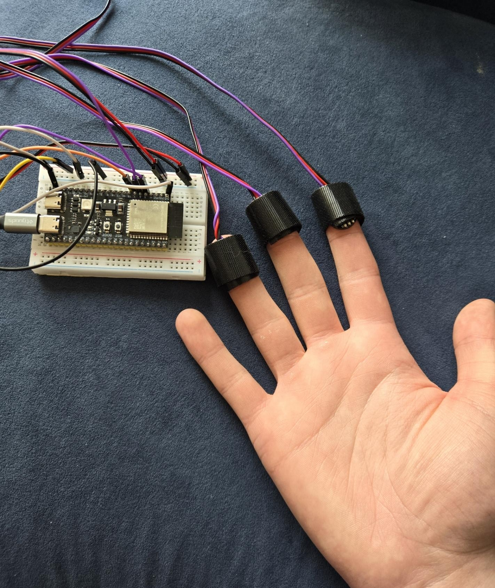

I created a multi-PPG system that takes readings on different fingertips to get a
more accurate BPM reading. The goal of the multiple sensors is to reduce the influence of noise
due to motion artifacts. I collected data from multiple PPG sensors placed on different
fingertips with different amounts of motion. I used ESP32 paired with multiple fingertip PPG sensors to collect the data. The data was logged to a file in the ESP32 filesystem.  The "file viewer" folder is used to create a web server to extract the data. The Python and Matlab code were used for the data processing. The full report can be viewed in the attached PDF.
